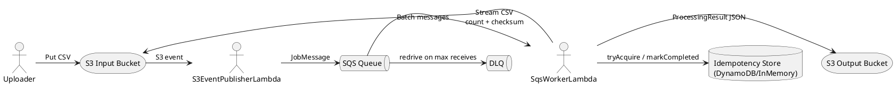

# aws-file-processing-pipeline

## Badges

[](https://github.com/psteixeira23/aws-file-processing-pipeline/actions/workflows/ci.yml)
[](https://sonarcloud.io/summary/new_code?id=psteixeira23_aws-file-processing-pipeline)
[](https://sonarcloud.io/summary/new_code?id=psteixeira23_aws-file-processing-pipeline)
[](https://sonarcloud.io/summary/new_code?id=psteixeira23_aws-file-processing-pipeline)
[](https://sonarcloud.io/summary/new_code?id=psteixeira23_aws-file-processing-pipeline)
[](https://sonarcloud.io/summary/new_code?id=psteixeira23_aws-file-processing-pipeline)

## Executive summary

- Streaming CSV processing (no full-file load into memory)
- Idempotent, retry-safe pipeline with SQS + DLQ behavior
- Clean Architecture with zero AWS SDK dependencies in domain/application
- Structured logs with correlation fields (`jobId`, `s3Key`)
- Quality gate: 80% line coverage enforced for application layer

## Problem statement

Build a production-grade, event-driven pipeline that processes CSV files uploaded to S3. Each upload triggers a job event in SQS, a Lambda worker processes the CSV in streaming mode, and writes a JSON summary to an output S3 bucket with retry and DLQ support.

## Architecture overview

- Clean Architecture layers: domain, application, infrastructure, entrypoint, common
- Domain and application are AWS-agnostic; AWS SDK lives in infrastructure adapters
- Use cases orchestrate job creation and processing
- Ports define outbound dependencies (S3, SQS, idempotency, metrics)
- Entry points wire AWS Lambda handlers and a local CLI runner

## Stack

- Java 21 (Temurin)
- Maven 3+
- JUnit 5
- JaCoCo (coverage >= 80% for application layer)
- Checkstyle (Google Java Style)
- SonarCloud (static analysis + quality gate)
- GitHub Actions (CI pipeline)

## Project standards and principles

- Clean Code + SOLID, small methods, and single-responsibility classes
- Strong separation of concerns via ports and adapters
- Explicit value objects for invariants (UUID job IDs, S3 bucket/key)
- Streaming I/O for large-file safety
- Idempotency by default for at-least-once delivery

## Design patterns (and why)

- Ports and Adapters (Hexagonal): isolates AWS dependencies and maximizes testability
- Adapter pattern: AWS SDK clients are wrapped behind ports to avoid infrastructure leakage
- Value Object: `JobId` and `S3Location` enforce invariants at the boundary
- Use Case / Command: `CreateJobUseCase` and `ProcessJobUseCase` are explicit application actions
- DTO: `JobMessage` and `ProcessingResult` define stable message contracts
- Idempotent Consumer (integration pattern): prevents duplicate processing on retries

## Event flow

- S3 upload triggers `S3EventPublisherLambda`
- Lambda validates CSV input and publishes `JobMessage` to SQS
- `SqsWorkerLambda` consumes SQS messages and processes the CSV in chunks
- Worker writes `ProcessingResult` JSON to `output/{jobId}.json` in output bucket
- Idempotency store prevents duplicate processing on retries or duplicates

## Diagram

ASCII overview:

```
  [S3 Input Bucket]
          |
          v
  S3EventPublisherLambda
          |
          v
     [SQS Queue] ---> [DLQ]
          |
          v
    SqsWorkerLambda
          |
          v
  [S3 Output Bucket]
```

PlantUML:



## How to run locally

- Build: `mvn clean test`
- Local runner:
  - `mvn -q -DskipTests exec:java -Dexec.mainClass=com.patrick.awsfileprocessing.entrypoint.local.LocalRunner -Dexec.args="/path/to/input.csv"`
  - Output JSON prints to stdout

## Structure

```
aws-file-processing-pipeline/
├── .github/workflows/ci.yml
├── config/checkstyle/google_checks.xml
├── src/
│   ├── main/java/com/patrick/awsfileprocessing
│   └── test/java/com/patrick/awsfileprocessing
├── CHANGELOG.md
├── pom.xml
└── sonar-project.properties
```

## Run locally

```bash
# Compile, test, and run quality gates
mvn clean verify

# Run Checkstyle
mvn checkstyle:check

# Generate JaCoCo report
mvn jacoco:report
```

Reports will be available at:

```
target/site/jacoco/index.html
```

## Configuration

Environment variables:

- `INPUT_BUCKET` (optional for publisher, required for integration tests)
- `OUTPUT_BUCKET`
- `JOB_QUEUE_URL`
- `AWS_REGION`
- `IDP_MODE` = `IN_MEMORY` or `DYNAMODB`
- `DDB_TABLE_NAME` (required when `IDP_MODE=DYNAMODB`)
- `EXCLUDE_HEADER=true|false`

## AWS deployment (high level)

- Create S3 input bucket and S3 output bucket
- Create SQS queue with DLQ configured and redrive policy
- Deploy `S3EventPublisherLambda` with S3 event notifications
- Deploy `SqsWorkerLambda` with SQS trigger and partial batch response enabled
- Grant Lambda IAM permissions for S3, SQS, and DynamoDB (if enabled)

## CI and SonarCloud setup

- GitHub Actions workflow: `.github/workflows/ci.yml`
- SonarCloud secrets: `SONAR_TOKEN`, `SONAR_PROJECT_KEY`, `SONAR_ORGANIZATION`
- SonarCloud properties: `sonar-project.properties`
- Maven plugin: `org.sonarsource.scanner.maven:sonar-maven-plugin`

## SonarCloud

Project dashboard:
`https://sonarcloud.io/project/overview?id=psteixeira23_aws-file-processing-pipeline`

## Security and secret scanning

- Gitleaks runs in CI to prevent accidental secret leaks
- Config: `.gitleaks.toml`

## Changelog

- Release notes live in `CHANGELOG.md`

## Checkstyle configuration

- Google Java Style rules: `config/checkstyle/google_checks.xml`
- Javadoc checks are removed to keep code comment-free

## Idempotency strategy

- Each job uses a `JobId` UUID and computes a SHA-256 checksum while streaming
- Idempotency store tracks in-progress and completed jobs by `jobId` and checksum
- Replayed messages exit early if already completed

## Retry/DLQ behavior

- Worker throws on processing errors so SQS retries apply
- Partial batch response requeues only failed messages
- After max receives, SQS moves messages to DLQ

## Observability

- Structured key/value logs with `jobId` and `s3Key` correlation fields
- Metrics hooks: `jobs_processed` counter, `job_processing_time_ms` timing

## Testing and quality gates

- Unit tests: CSV streaming, idempotency behavior, output key convention, JobMessage JSON
- Use case tests: CreateJobUseCase flow and in-progress idempotency path
- JUnit 5 + AssertJ for assertions, Mockito ready for mocks
- Jacoco enforces 80% line coverage for application layer
- JaCoCo XML report is generated during `mvn verify` for SonarCloud
- Checkstyle validates code style during `mvn verify`
- GitHub Actions runs `mvn verify` on every PR and main branch push
- SonarCloud analysis runs in CI when secrets are configured

## Tradeoffs and future work

- DynamoDB idempotency store is minimal and can be hardened with conditional updates
- Metrics adapter is a no-op; integrate CloudWatch EMF or OpenTelemetry
- Add Terraform/CDK for infrastructure provisioning
- Consider ECS or Step Functions for larger file workloads

## License

Licensed under the [MIT License](LICENSE).

## Contributing

1. Fork this repository
2. Create a new branch (`git checkout -b feature/my-feature`)
3. Commit your changes using [Conventional Commits](https://www.conventionalcommits.org/en/v1.0.0/)
4. Push to your branch and open a Pull Request

Every PR triggers:

- Unit tests (JaCoCo 80% minimum coverage)
- Code style validation (Checkstyle)
- Static analysis (SonarCloud)
- Quality Gate review before merge

## Commit convention

This project follows [Conventional Commits](https://www.conventionalcommits.org/):

- `feat:` – new feature
- `fix:` – bug fix
- `chore:` – maintenance or CI updates
- `docs:` – documentation changes
- `test:` – adding or refactoring tests

Example:

```
feat(api): add csv streaming processor
fix(ci): adjust Maven cache key on GitHub Actions
```

## About

Created and maintained by **Patrick Teixeira** 🇧🇷  
Backend Engineer | Java • Go • AWS • Clean Architecture • CI/CD
LinkedIn: `https://www.linkedin.com/in/patrick-de-souza-teixeira/`

> “Quality is never an accident; it is always the result of intelligent effort.” – John Ruskin
